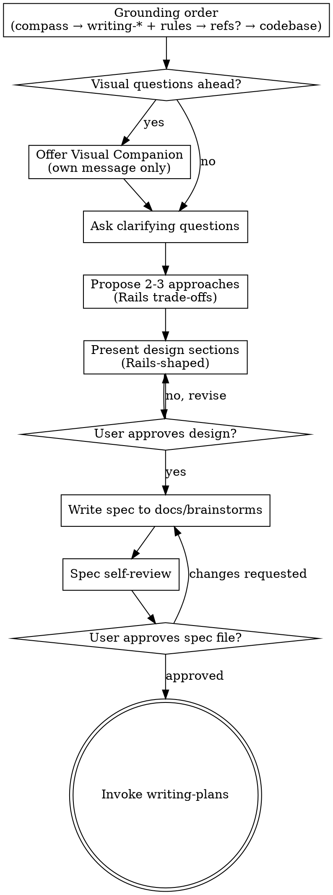

# Brainstorming Into Rails-Shaped Designs

Turn ideas into an approved **requirements spec** through dialogue, with **omakase / DHH-shaped Rails** as the constraint: majestic monolith, server-owned truth, REST gravity, fat models and thin orchestration, Hotwire-first HTML, and **Pitchd plugin** tactics (`rules/*.mdc`, `writing-*` skills) as the implementation ceiling.

**Announce:** "I'm using the brainstorming-rails-omakase skill."

**Plugin rules beat application patterns:** Where the app contradicts plugin rules, the spec describes the **correct** Pitchd / omakase direction for new work and notes integration friction — same as **`agents/pitchd-rails-query.md`**.

## Grounding order (always)

Use the **same order** as **`agents/pitchd-rails-query.md`** so this skill has the full Pitchd stack at hand — not just the compass.

1. **`skills/rails-omakase-compass/SKILL.md`** — For **architectural** questions (boundaries, "should we…", API vs HTML, where logic belongs, jobs vs request, anything that could pull the app off-Rails or split ownership badly), read the compass **first**. For **purely tactical** questions (e.g. local Hotwire / Stimulus wiring in an otherwise settled design), you may open the relevant **`writing-*`** skill first; still use the **compass** whenever the answer could change solution shape.

2. **Scoped tactical layer** — Read **`skills/writing-*/SKILL.md`** files that match the brainstorm topic (see **Topic → assets** below). Pair with **`rules/*.mdc`** for the same areas — **do not skip** a rule file that applies to what you are designing.

3. **Supplementary reference — required when compass and writing-* leave a gap** — Consult these when a pattern isn't clearly covered above; treat as a required consult for those gaps, not optional enrichment:
   - **`skills/referencing-unofficial-37signals-guide/SKILL.md`** — 37signals / Fizzy-derived patterns or "what would DHH-style say about X."
   - **`skills/referencing-rails-guides/SKILL.md`** — authoritative Rails API and feature docs.

   Both **inform** the brainstorm — they do **not** override plugin rules or skills. If a fetch fails, **report that** per the skill; **do not** invent or assert content from memory.

4. **User's codebase** — If the workspace is a Rails app and the brainstorm is project-specific, read the **relevant** files (models, controllers, routes, policies, etc.) after the plugin layers above; tie the spec to what you saw.

**Routing:** Use **Topic → assets** to load **only** the **`writing-*`** skills and **`rules/*.mdc`** files that match the topic — not every file unless the brainstorm is genuinely cross-cutting.

### Topic → assets (load what applies)

| Area | Skill(s) | Rules |
|------|----------|--------|
| Stack shape, boundaries, "where should this live?" | compass (+ `writing-services` if extraction) | `services.mdc`, `models.mdc`, `controllers.mdc` as needed |
| Models, AR, domain | `writing-models` | `models.mdc` |
| Controllers, params, REST | `writing-controllers` | `controllers.mdc` |
| Routes | `writing-routes` | `routes.mdc` |
| Views, helpers, partials | `writing-views` | `views.mdc` |
| Hotwire, Turbo, Stimulus | `writing-hotwire` | `hotwire.mdc` |
| CSS / Tailwind | `writing-css-tailwind` | `css-tailwind.mdc` |
| JavaScript | `writing-javascript` | `javascript.mdc` |
| I18n | `writing-i18n` | `i18n.mdc` |
| Mailers | `writing-mailers` | `mailers.mdc` |
| Jobs, Solid Queue, async | `writing-jobs` | `jobs.mdc` |
| Policies / authorization | `writing-policies` | `policies.mdc` |
| Migrations, schema | `writing-migrations` | `migrations.mdc` |
| Tests | `writing-tests` | `testing.mdc` |
| RuboCop / style gates | `running-rubocop` when relevant to the design | `rubocop.mdc` |
| Naming (classes, methods, columns, routes, specs) | `writing-naming-conventions` | `naming.mdc` |
| Planning / execution context | `writing-plans`, `executing-pitchd-rails-plan`, `implementing-pitchd-rails`, `reviewing-pitchd-rails` | only when the brainstorm is about **how** to plan or run those workflows in this plugin |

Pull in workflow skills only when the conversation is explicitly about those processes — not for routine feature design (those stay behind the HARD-GATE until **`writing-plans`**).

<HARD-GATE>
Do **not** invoke **`implementing-pitchd-rails`**, **`executing-pitchd-rails-plan`**, or any implementation skill; do **not** write application code, migrations, or tests; do **not** scaffold until you have presented a design and the user has approved it, then written the spec file and passed the user review gate below. This applies to every change regardless of perceived size.
</HARD-GATE>

## Anti-pattern: "Too small to need a spec"

Unexamined assumptions waste the most effort on "small" changes. The spec can be a short paragraph, but you **must** present it, get approval, write it to disk, and get user sign-off on the file before **`writing-plans`**.

## Checklist

Create a task for each item and complete **in order**:

1. **Ground in Pitchd order** — For every substantive turn and before locking a design direction, apply **Grounding order (always)** for the areas this brainstorm touches (compass → scoped **`writing-*`** + **`rules/*.mdc`** → supplementary refs if needed → then relevant app files). Re-run when the topic shifts to a new area (e.g. from routes to jobs).
2. **Offer visual companion** (if upcoming questions are visual) — **its own message only**; see Visual Companion below.
3. **Ask clarifying questions** — one per message; purpose, constraints, success criteria.
4. **Propose 2–3 approaches** — trade-offs in **Rails terms** (resources vs RPC, HTML vs JSON, sync vs job, model vs controller vs policy), consistent with what you already loaded. For each approach, **state explicitly where the domain logic will live** (model method, callback, scope, concern) — not implicit.
5. **Present design in sections** — scaled to complexity; approval after each section.
6. **Write spec** — default path **`docs/brainstorms/YYYY-MM-DD-<topic>.md`** in the app repo (create `docs/brainstorms` if needed; user or team conventions override).
7. **Spec self-review** — placeholders, contradictions, ambiguity, scope; fix inline.
8. **User reviews written spec** — wait for approval or revision requests.
9. **Transition to planning** — invoke **`writing-plans`** only.

## Process flow

**Terminal state is `writing-plans`.** Do **not** jump to **`implementing-pitchd-rails`**, **`writing-hotwire`**, or other implementation skills from this workflow.

## Rails-shaped design content

Scale sections to complexity. Prefer vocabulary that will survive into **`writing-plans`** without re-litigating philosophy:

| Lens | Cover |
|------|--------|
| **Domain** | Nouns, verbs, state. Prefer **state-as-records** over accumulating boolean flags — an explicit status string column with defined transitions, or a dedicated records table, beats `published_at` + `archived_at` + `deleted_at` proliferation. For request context (who, which account), thread through `Current` attributes (`Current.user`, `Current.account`) rather than method parameters or redundant queries. |
| **REST surface** | Resources and conventional verbs. **When an action seems RPC-shaped, first model it RESTfully** — what resource does this action create, update, or destroy? (`send_invoice` → `POST /invoices/:id/deliveries`; `approve` → `POST /approvals`). Only after that attempt fails should you document the exception, stating what you tried and why no conventional mapping fits. |
| **Truth** | Server owns persisted state, authorization, **derived state** (totals, computed fields, summaries), and access context (user role, account). Client must not be the source of truth for any of these — including caching roles in localStorage or computing summaries from already-rendered data. |
| **Account scoping** | If the app has accounts, confirm: is every resource in this design scoped to an account? How does the query enforce scope? Unscoped queries are where cross-tenant leaks begin — catch it here, not in implementation. |
| **Logic placement** | State explicitly where domain rules live for each proposed approach — model method, callback, scope, concern. If logic doesn't fit a model or concern, name the specific collaborator type (form object for multi-model forms, value object for domain types, query object for complex scopes) and explain why a model method cannot handle it. Generic service objects as orchestrators are not an option. Is behavior cross-cutting across multiple models? Name the concern. |
| **UI** | Hotwire (Turbo, Stimulus) and server-rendered HTML first; extra JS only with explicit need (see `rules/hotwire.mdc`, `rules/javascript.mdc`). |
| **Authorization** | Who may do what — aligns with **Pundit** / policies at the boundary (`rules/policies.mdc`). |
| **Async** | Ask first: does this actually need to be async (slow, unreliable third-party, high-volume side effect)? "Separation of concerns" is not a reason for a job. When async is warranted, jobs are thin wrappers around model behavior (`rules/jobs.mdc`). |
| **Data** | Migrations only at planning/implementation — here, entities and constraints only as needed for decisions. Prefer simple foreign keys and denormalized columns over junction tables and polymorphic joins until domain complexity is proven. |
| **Testing intent** | Behaviour-first, right layer — delegate detail to **`writing-tests`** / `rules/testing.mdc` in the plan phase. |

**Design for clear Rails boundaries:** Vertical slices (resource/feature cohesion), one obvious home for domain rules (models, concerns — not generic service registries). If the brainstorm drifts toward "generic executor," "repository on thin models," or duplicated rules in JS, stop and realign with **`rails-omakase-compass`**.

**Working in existing codebases:** Follow patterns that match **plugin rules**. Where the app contradicts those rules, the spec should describe the **correct** Rails-shaped direction for new work (same rule as **`implementing-pitchd-rails`** and **`writing-plans`**) and note integration friction — not silently entrench anti-patterns.

## The process (mirrors superpowers brainstorming)

**Understanding the idea**

- After **Grounding order (always)**, use what you read in the app (step 4) to describe current state — verify claims; do not assume tables or routes exist without checking when that matters.
- If the request bundles multiple independent subsystems, decompose first; brainstorm one slice per cycle (spec → plan → implementation).
- One question per message; prefer multiple choice when it speeds alignment.
- Clarify purpose, constraints, success criteria.

**Exploring approaches**

- Always offer **2–3** options when meaningful, with trade-offs in **Rails** terms.
- State a recommendation and why — omakase defaults win until a **measured** cost appears (**`rails-omakase-compass`**).

**Presenting the design**

- Sections sized to nuance; pause for approval between sections.
- Include architecture, data flow, errors, and **where tests will eventually prove behaviour** (not full RSpec here — intent only).

## After the design

**Documentation**

- Write the validated spec to **`docs/brainstorms/YYYY-MM-DD-<topic>.md`** (unless the user names another path).
- Commit the spec when the repo is yours to commit; otherwise leave changes ready for the human.

**Spec self-review**

1. Placeholder scan — no TBD that blocks planning.
2. Internal consistency — behaviour vs boundaries.
3. Scope — one implementation plan or explicit split.
4. Ambiguity — resolve dual interpretations.

**User review gate**

> Spec written to `<path>`. Please review and say if you want changes before we write the implementation plan.

Wait for response; revise and re-review until approved.

**Planning**

- Invoke **`writing-plans`** with the spec as input. **Only** that skill follows this one.

## Key principles

- **One question at a time**
- **Multiple choice when it helps**
- **YAGNI** on features and on architectural novelty
- **Alternatives** before commitment
- **Incremental validation** of the design
- **Omakase first** — documented exceptions, not silent drift

## Visual companion

When upcoming questions will benefit from mockups, layout comparisons, or diagrams in a browser, offer the companion **once**, in **its own message** (no other content):

> Some of what we're working on might be easier to show in a web browser — mockups, diagrams, comparisons. This can be token-intensive. Want to try it?

Wait for an answer. If declined, continue in text.

Per question: use visuals only when **seeing** beats **reading** (layouts, wireframes). Pure trade-off or requirement questions stay in chat.

## Common mistakes

| Mistake | Fix |
|---------|-----|
| Reading the app before compass / **`writing-*`** / **`rules/*.mdc`** on architectural questions | Follow **Grounding order (always)** — same order as **`pitchd-rails-query`**. |
| Loading every `writing-*` and rule without routing | Use **Topic → assets**; expand only when cross-cutting. |
| Coding or migrating during brainstorm | Stop; complete spec and **`writing-plans`** first. |
| Defaulting to JSON/SPA for app flows | Re-read **HTML as primary interface** in **`rails-omakase-compass`**. |
| "If an RPC-shaped action is unavoidable…" | It almost never is. Model it RESTfully first — find the resource the action creates, updates, or destroys. Document exception only after the attempt. |
| New "service object" as the first idea | Ask what **model** or **concern** owns the behaviour (`rules/services.mdc`). Name the specific collaborator type if extraction is genuinely needed. |
| "Justified collaborator" as rationale for extraction | Justify specifically: form object, value object, query object. "Justified" without specifics is how service layer creep starts. |
| Skipping compass on "small" features | Skim **`rails-omakase-compass`** whenever boundaries move. |
| Skipping account scoping on any resource design | Ask: is every query in this design scoped to the account? |
| Skipping `Current` attributes for request context | Thread `Current.user` / `Current.account`; do not pass context as method parameters or re-query it redundantly. |
| Premature namespacing (`Admin::`, `Api::V1::`) | Ask: does this namespace pay for itself **today**? Speculative structure is YAGNI. |
| Speculative polymorphism | Build for what exists today; extract when the second concrete case actually arrives. |
| Over-normalized schema for unproven domain richness | Prefer simple foreign keys and denormalized columns; add junction tables and polymorphic joins when domain complexity is demonstrated. |
| Async for "separation of concerns" | Job if it's slow, unreliable, or high-volume. Not as an architectural default. |
| Skipping user approval of the **file** | Chat agreement is not enough — gate on reviewed spec on disk. |

## Related

- **`agents/pitchd-rails-query.md`** — same **Grounding order** and **Topic → assets** table (readonly Q&A; this skill is brainstorm + spec).
- **`skills/rails-omakase-compass/SKILL.md`** — whether the shape fits.
- **`skills/writing-plans/SKILL.md`** — next step after an approved spec.
- **`skills/implementing-pitchd-rails/SKILL.md`** — after a plan exists, not during brainstorm.
